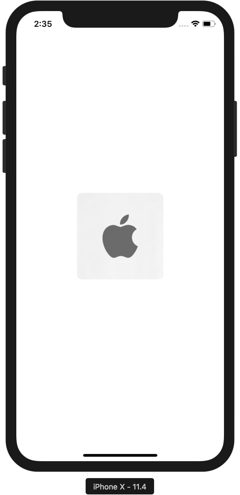

:name: BlurHUD
:author: Elias Abel
:author_esc: Elias%20Abel
:mail: admin@meniny.cn
:desc: an re-implementation of the Apple\'s HUD
:icon: {name}.png
:version: 1.1.0
:na: N/A
:ios: 8.0
:macos: {na}
:watchos: {na}
:tvos: {na}
:linux: {na}
:xcode: 10.2
:swift: 5
:license: MIT
:sep: %20%7C%20
:platform: iOS
// :toc: left
:toclevels: 6
:toc-title: TOC
:source-highlighter: highlightjs
// :source-highlighter: pygments
= Meet `{name}`
{author} <{mail}>
v{version}, 2018-06-15

[subs="attributes"]
++++

  
    
  
  
  
   
  
  
  
   
  
  
  
  

++++

:toc:

== 🏵 Introduction

**{name}** is {desc}.

== 📋 Requirements

[%header]
|===
2+^m|Type 1+^m|Requirement

1.5+^.^|Platform ^|iOS ^|{ios}+
^|macOS ^|{macos}
^|tvOS ^|{tvos}
^|watchOS ^|{watchos}
^|Linux ^|{linux}

^|IDE ^|Xcode ^| {xcode}+
^|Language ^|Swift ^| {swift}+
|===

== 📲 Installation

=== CocoaPods

`{name}` is available on link:https://cocoapods.org[CocoaPods].

[source, ruby, subs="verbatim,attributes"]
----
use_frameworks!
pod '{name}'
----

=== Manually

Copy all files in the `{name}` directory into your project.

== 🛌 Dependency

{na}

== ❤️ Contribution

You are welcome to fork and submit pull requests.

== 🔖 License

`{name}` is open-sourced software, licensed under the link:./LICENSE.md[`{license}`] license.

== 🔫 Usage

[source, swift, subs="verbatim,attributes"]
----
import {name}

BlurHUD.show(.error)
BlurHUD.hide(afterDelay: 2.0)
----

[source, swift, subs="verbatim,attributes"]
----
import {name}

BlurHUD.flash(.success, delay: 2.0)
----

[source, swift, subs="verbatim,attributes"]
----
import {name}

let image = ...
BlurHUD.flash(.rotatingImage(image), delay: 2.0)
----

[source, swift, subs="verbatim,attributes"]
----
import {name}

BlurHUD.flash(.label("Requesting from the server..."), delay: 2.0) { _ in
    BlurHUD.flash(.labeledSuccess(title: nil, subtitle: "Obtained"), delay: 2.0)
}
----

Please note that the above demonstrates the "porcelain" interface - a more concise and clean way to work with the `BlurHUD`.

If you need more options and flexbility, feel free to use the underlying "plumbing". E.g.:

[source, swift, subs="verbatim,attributes"]
----
import {name}

HUD.sharedHUD.show()
HUD.sharedHUD.contentView = HUDSuccessView(title: "Success!", subtitle: nil)
HUD.sharedHUD.hide(afterDelay: 2.0)
----
